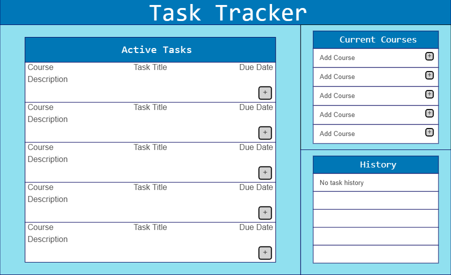

# Task Tracker

### Project Description 📝
This is an interactive application that allows users to manage and track course-related tasks.



### Implementation 🛠
The technology used in the creation of the application includes TypeScript and Node.js and it was developed with a Model-View-Controller (MVC) architecture.
Built using TypeScript and Node.js, this application follows a Model-View-Controller architecture for clean separartion of concerns.

### Setup 🚀
To set up the project environment, follow these steps:
1. ```git submodule init```
2. ```git submodule update```
3. ```npm install```

To run the application, use:
1. ```npm run dev```
